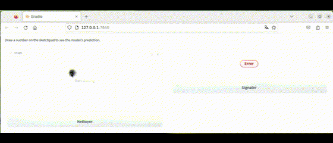

# 5GMM_AIF1
Part of the AI Framework course of GMM, INSA Toulouse

In this project, we train a simple cnn network for classification on the MNIST dataset, then develope an API and web app to deploy said model.



To train a fresh model call in terminal
``` terminal
python train.py
```

To use the web app, first launch an API
``` terminal
python mnist_api.py
```
then launch the web app in a seperate terminal
``` terminal
python mnist_webapp.py
```
